# MemoryGate

[Pi conversation memory: admission, retries, forgetting and bilingual drills](docs/conversation-memory.md).


MemoryGate is a local-first memory service for one personal AI agent. It receives evidence, preserves lineage, turns durable signals into structured memory, and returns a bounded context package that an agent can use without direct database access.

It is deliberately not a general chatbot, autonomous executor, or replacement for your main agent. MemoryGate stores, retrieves, and explains knowledge. Your agent remains responsible for reasoning and action.

## What It Solves

Personal agents need reliable context without carrying an entire history in every prompt. MemoryGate separates that problem into durable layers:

| Layer | Purpose |
| --- | --- |
| Evidence | Immutable raw inputs from listeners, sessions, APIs, or manual capture. |
| Analysis | A recorded interpretation of one or more evidence objects. |
| Memory | Durable facts, phases, context, and watch items suitable for retrieval. |
| Entity | Structured people, projects, places, concepts, habits, and objects. |
| Episode | A time-bounded event that groups related evidence. |

Every object can be inspected in the dashboard alongside its history, links, and supporting material.

## Architecture

```text
Agent / Listener
      |
      v
Evidence ingress --> Evidence object --> Processing job --> Analysis --> Memory / Entity / Episode
      |                                                        |
      +------------------------------ lineage -----------------+

Agent read key --> bounded context retrieval --> Memory Lab or agent response
```

### Storage and Search

- **PostgreSQL** is the source of truth for all memory, evidence, history, audit, and configuration records.
- **Qdrant** is the semantic vector index used to retrieve meaningfully related memories, entities, and observations.
- **Lexical matching** supplements vector results so exact names and project terms are not hidden by similarity ranking.
- **Embeddings are not shipped yet.** No embedding provider is installed in the API image, so semantic
  retrieval is unavailable and MemoryGate says so instead of guessing.

### Semantic retrieval is currently degraded

This is a known, reported state, not a silent one:

- `GET /health` reports `degraded` and names `embeddings`.
- `POST /runtime/context` and `POST /memory/search` return a `retrieval` block giving the mode
  (`hybrid` or `lexical`) and why semantic search is unavailable, and every result carries the
  `retrieval_path` that produced it.
- `/runtime/context` also states the degradation inside `usage.instruction`, which is the text the
  reading model actually sees.
- Writes still succeed - Postgres is the source of truth - and report `indexing: degraded` when the
  row could not be added to the vector index, plus `novelty_check: degraded` when the near-duplicate
  check could not run.

An earlier `EMBED_MODEL=hash` mode has been **removed**. It derived each vector component from
`sha256(index:text)`, so near-identical sentences produced uncorrelated vectors and cosine similarity
over them was noise. It made retrieval look like it worked while returning confident nonsense.

Changing the configured LLM does **not** change the vector database or embeddings. The LLM is used only for bounded evidence analysis and read-only answers.

## Security Model

MemoryGate assumes the dashboard is an administrative surface and keeps agents on a separate read-only interface.

- **MemoryGate refuses to start with no admin key configured.** There is no open fallback tier; the
  startup error names the exact fix. A key supplied through `MEMORYGATE_ADMIN_KEY` must be at least
  16 characters.
- **CORS defaults to the bundled dashboard's own origins** (`http://localhost:8021`,
  `http://127.0.0.1:8021`). `MEMORYGATE_CORS_ORIGINS=*` is a development override only - a wildcard
  puts every route in reach of any page the owner has open, and it is logged as a warning at startup.
- Destructive actions need a second, deliberate confirmation on top of admin auth: `POST
  /system/memory-reset` requires the exact phrase `RESET MEMORY`. A valid admin key alone is not
  enough.
- Admin keys are stored as PBKDF2-SHA256 hashes, never plaintext.
- Failed key verification is limited to five attempts with a five-minute lockout per client scope.
- Agent read keys are separate, scoped credentials. They can retrieve context but cannot ingest, edit, reset, or administer MemoryGate.
- Listener ingestion uses a source-specific secret, not the admin key.
- LLMs receive no write, delete, shell, or tool capability through MemoryGate.
- OpenAI API keys, when configured, are encrypted at rest in the MemoryGate server volume and never returned to the dashboard after saving.
- Backups exclude admin/read-key hashes and listener secrets.

Local deployment protects against remote misuse, not a fully compromised host. Running the agent and MemoryGate services on separate machines is the recommended next isolation step.

## Quick Start

### Prerequisites

- Docker Desktop with Compose
- Node.js 22+ only when running the dashboard outside Docker

### Start the services

`docker-compose.yml` joins an external Docker network and reads an optional `.env`. Both are
prerequisites of a clean checkout:

```bash
docker network create conker_net          # once; compose declares it external
cp .env.example .env
echo "MEMORYGATE_ADMIN_KEY=$(openssl rand -base64 24)" >> .env
docker compose up -d --build
```

Without an admin key the API exits at startup with an error naming this exact fix. That is
deliberate: a service with no key configured must not fall back to open.

Start the optional local Ollama runtime only when you explicitly want it:

```bash
docker compose --profile local-ai up -d ollama
```

The default services are:

| Service | Address |
| --- | --- |
| Dashboard | `http://localhost:8021` |
| API | `http://localhost:8020` |
| PostgreSQL | `localhost:5434` |
| Qdrant | `localhost:6335` |
| Ollama | `localhost:11434` when the `local-ai` profile is enabled |

The dashboard can also be started with `npm run build` from `dashboard/`. Development runtime addresses may differ from the Compose defaults.

### Configure access

1. Open **Settings** in the dashboard.
2. Change the initial admin key to a long unique value.
3. Create one read key for your agent integration.
4. Add evidence sources and their listener secrets only through the dashboard.

## AI Runtime

MemoryGate supports two bounded model providers from **Settings -> AI Runtime**:

- **Ollama** is the optional local provider. Start the `local-ai` profile first, then select any installed local model, such as `qwen3:4b`.
- **OpenAI API** accepts a model identifier and an OpenAI API key. The key is sent only from MemoryGate's API server to `api.openai.com`; it is never stored in browser storage or exposed to an agent.

The selected model can:

- Propose observations and memory candidates from evidence.
- Answer a read-only Memory Lab question from retrieved context.

The selected model cannot:

- Write, delete, reset, or call tools through MemoryGate.
- Receive a hidden Memory Lab conversation history.
- Replace semantic retrieval or directly access PostgreSQL/Qdrant.

OpenAI uses the server-side Responses API with a Bearer API key. Keep the key private and treat provider usage as paid external processing. See the [OpenAI API quickstart](https://platform.openai.com/docs/quickstart/make-your-first-api-request) and [model catalog](https://developers.openai.com/api/docs/models).

## Dashboard

The dashboard is a single-workspace operating console for one agent:

- **Command Center**: system counts, signal health, recent activity, and promotion metrics.
- **Live Pipeline**: a timestamped trace of incoming data through evidence, analysis, knowledge, and write decisions.
- **Memories**: inspect, create, edit, and connect durable fact, phase, context, and watch records.
- **Entities**: browse people, projects, concepts, and linked evidence with graph navigation.
- **Memory Lab**: saved browser-session investigations. Each question is independent and read-only; inspect the exact objects supplied to the model.
- **Database**: search and inspect every object type in one table.
- **Sources & Evidence**: manage listener credentials, inspect immutable evidence, and verify ingest endpoints.
- **Episodes / Sessions / Observations / Derived Patterns**: focused views for time-bounded events, transcript archives, extracted signals, and promoted patterns.
- **Architecture**: developer-facing object, lineage, truth, and search model.
- **Settings**: keys, backups, AI runtime, and destructive operations.

## Screenshots

### Command Center

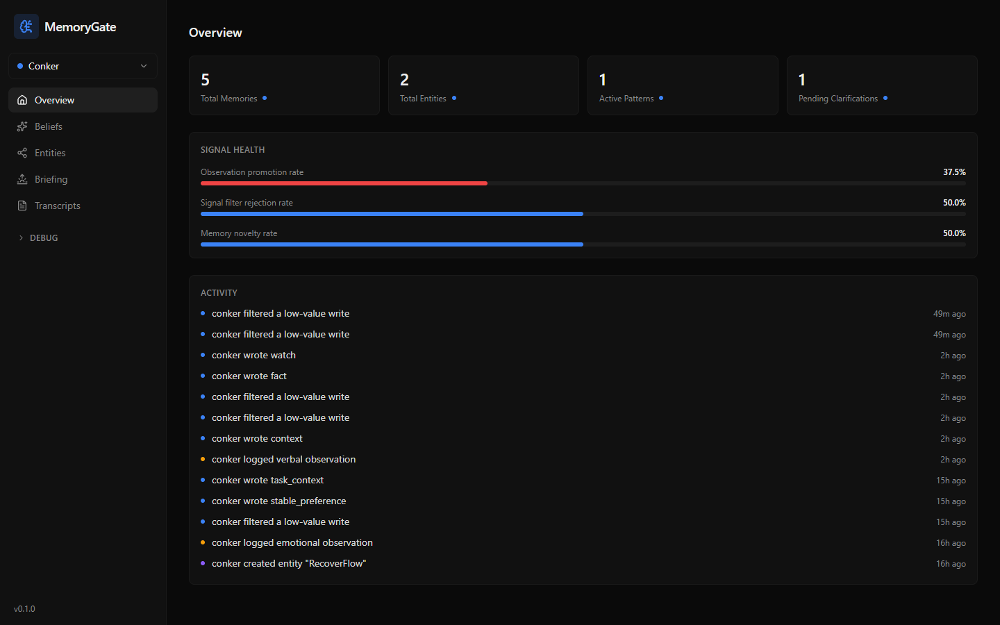

### Memories

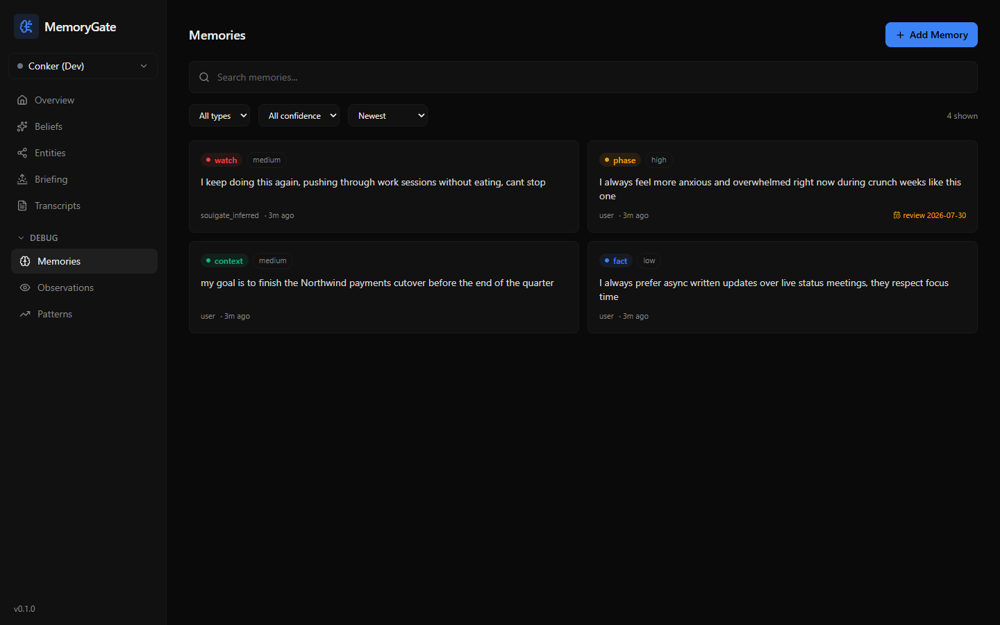

### Database Inspection

Search every durable object from one table, then open an object to inspect its
metadata, history, and connected records.

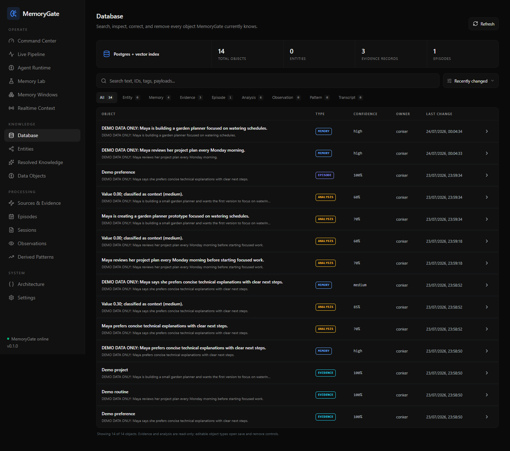

### Entities Graph

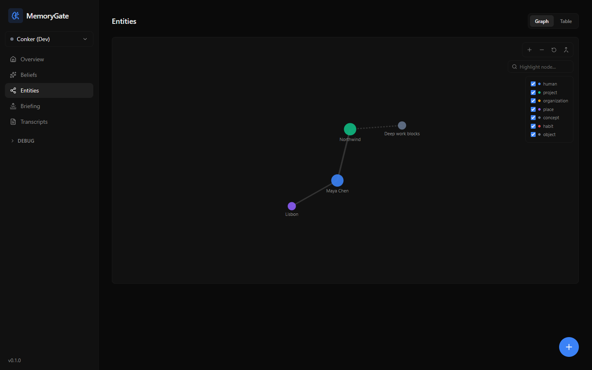

### Observations

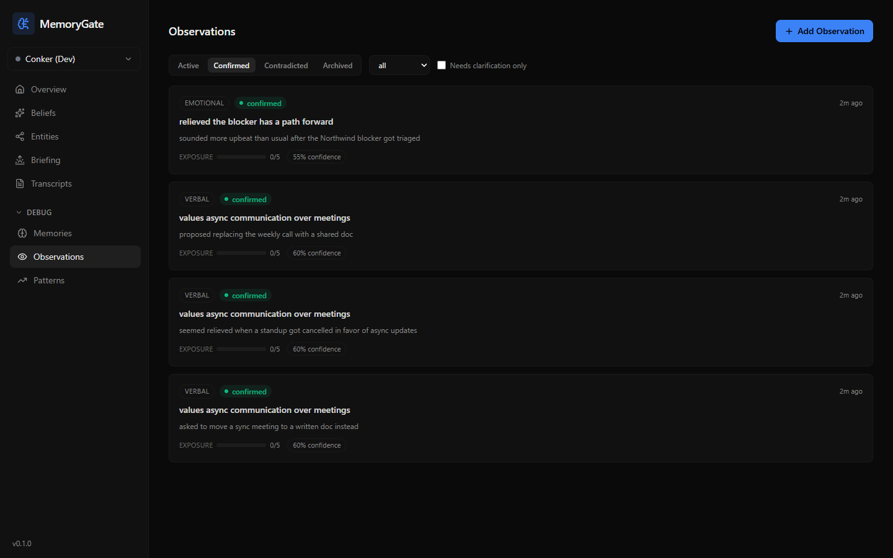

### Derived Patterns

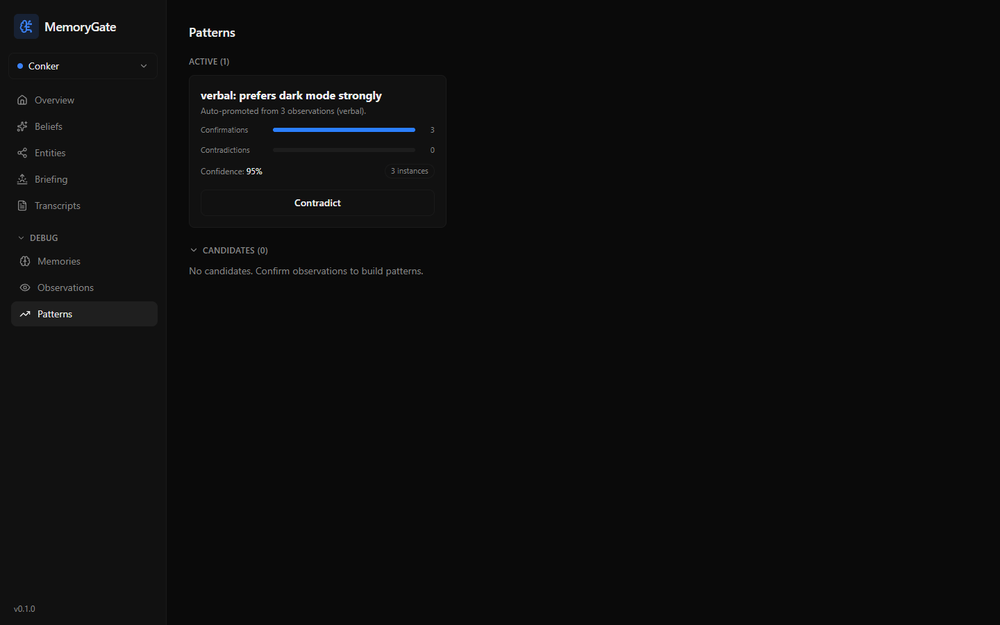

### Briefing

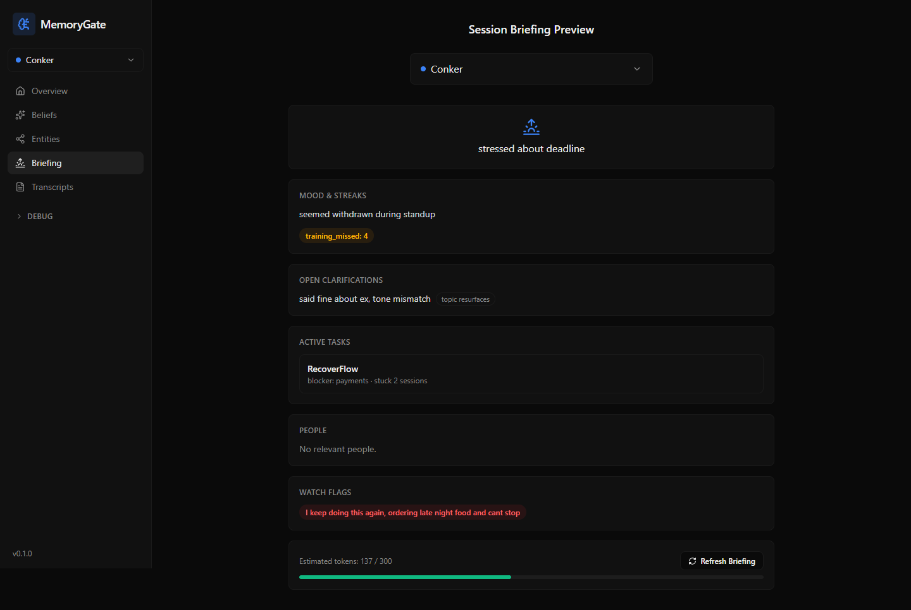

### Beliefs

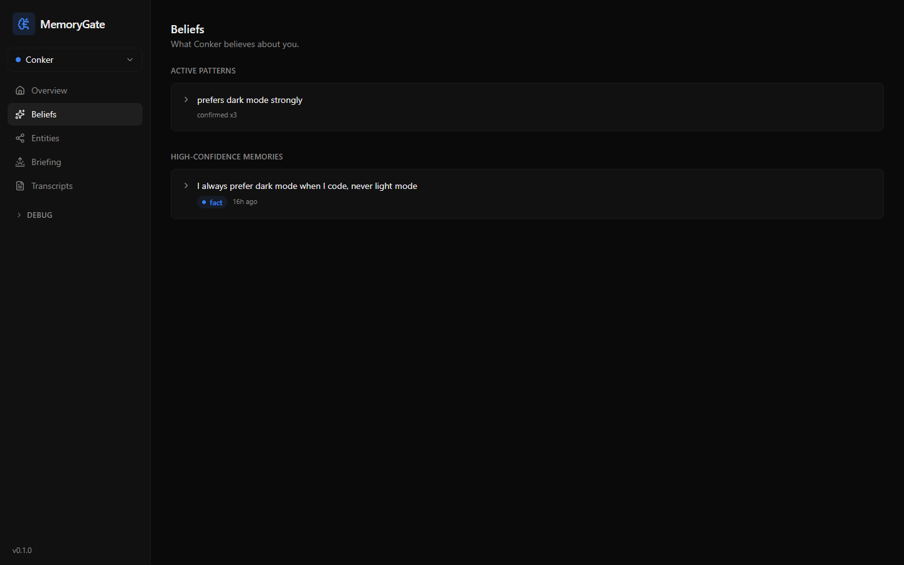

### Memory Lab

Memory Lab answers independent, read-only questions. It keeps an investigation
list only in the current browser session and exposes the exact retrieved
objects used for each answer.

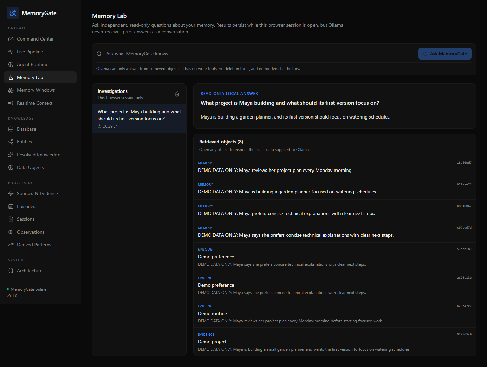

### Operations and Safety

Settings keeps access controls, backups, model configuration, and destructive
reset controls together. Reset actions require the current admin key and an
explicit confirmation phrase.

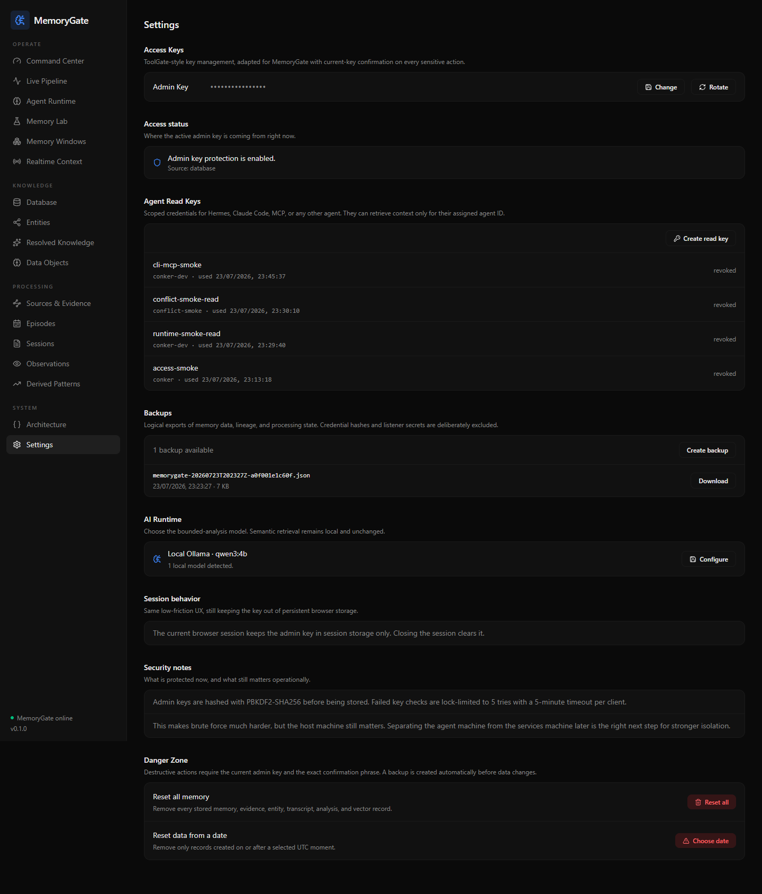

### Transcript Detail

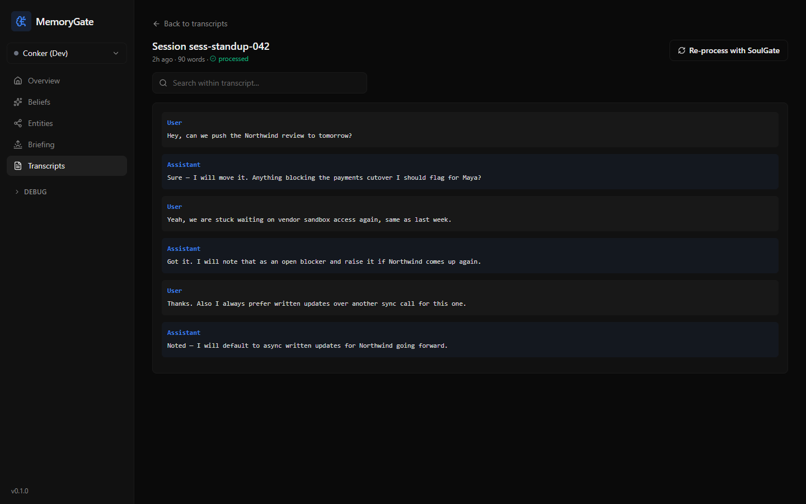

## Agent Integration

Give external agents a **read key**, not the admin key. They should retrieve context before answering or acting, then send raw events through a listener or approved ingest path.

```powershell
python services/cli/memorygate.py context "What should I remember about this project?"
```

An MCP configuration and a read-only agent skill are included under `integrations/`. These integrations are intentionally read-focused: external agents should not be able to rewrite the memory architecture by prompt injection.

## Evidence Ingestion

Create a source in **Sources & Evidence**, then send an event to its dedicated listener endpoint:

```text
POST /runtime/listeners/{source_key}
X-MemoryGate-Listener-Key: <source-specific secret>
```

An event becomes an immutable evidence object. With automatic processing enabled, it receives a processing job that may produce analysis, observations, and durable memory candidates. All resulting objects retain lineage rather than silently replacing their source.

## Backups and Reset

Settings provides logical JSON backups and a **Danger Zone**.

- **Create backup** exports memory data, lineage, and processing state to the persistent backup volume.
- **Reset all memory** removes all stored memory, evidence, entities, transcripts, analysis, episodes, processing records, and matching vector points.
- **Reset data from a date** removes records created on or after the selected date.

Every reset requires the current admin key and the exact phrase `RESET MEMORY`. A backup is created before any destructive change. Admin access, agent read keys, listener configuration, backups, and AI configuration are preserved.

## Development

### API

```powershell
cd services/api
docker build -t memorygate-api:local .
```

### Dashboard

```powershell
cd dashboard
npm ci
npm run build
```

### Tests

```bash
cd services/api
python -m venv .venv && . .venv/bin/activate
pip install -r requirements.txt -r requirements-dev.txt
python -m pytest tests
```

On Windows, drop `uvloop` from the install: it has no Windows build. The suite needs no running
services - it uses a real SQLite database and points its dependency probes at a closed port so the
degraded paths are exercised for real rather than mocked.

### Verification

```powershell
docker ps
Invoke-WebRequest -UseBasicParsing http://127.0.0.1:8020/health
```

`GET /health` is unauthenticated and runs real probes against PostgreSQL, Qdrant, and the embedding
provider. It reports `ok` only when all three answer, and otherwise `degraded` with each failing
dependency named. Probe detail is deliberately coarse, since the route has no auth. Results are
cached for five seconds and carry their `age_seconds`.

## Project Layout

```text
dashboard/             React administrative console
services/api/          FastAPI service, models, retrieval, workers, and security
services/cli/          Terminal client for agent integrations
services/mcp/          MCP server bridge
integrations/          Read-only agent skill and MCP configuration
```

## Operational Notes

- Keep all secrets out of Git. Use the Settings UI or server environment configuration.
- Do not expose the dashboard/API directly to the public internet. Put them behind a private network, VPN, or authenticated reverse proxy when leaving localhost.
- Backups are logical exports, not an encrypted disaster-recovery system. Protect the Docker volume and copy important backups to secure storage.
- MemoryGate can preserve evidence and history, but no automated system can guarantee a fact is true. Confidence, provenance, and review remain part of the design.
